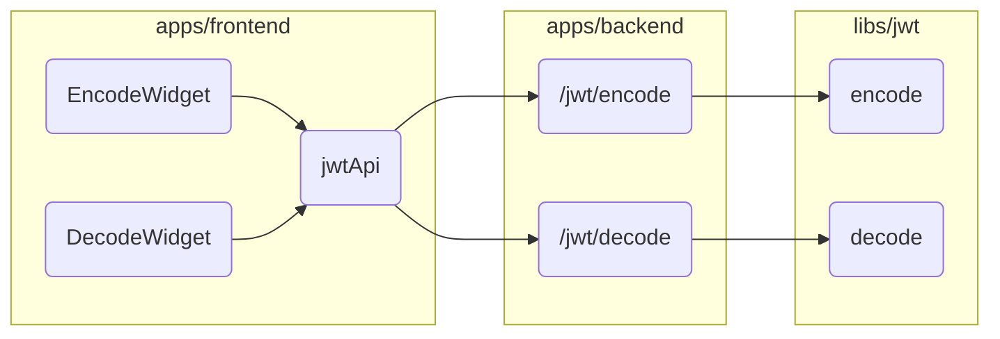

# Jwt Implementation Example

Stack: npm workspaces, typescript, koa, react, zustand.

## Scripts

Run app with docker compose:

```sh
docker-compose up -d
```

Run app in dev environment:

```sh
npm run dev
```

## Screenshot


## App structure


